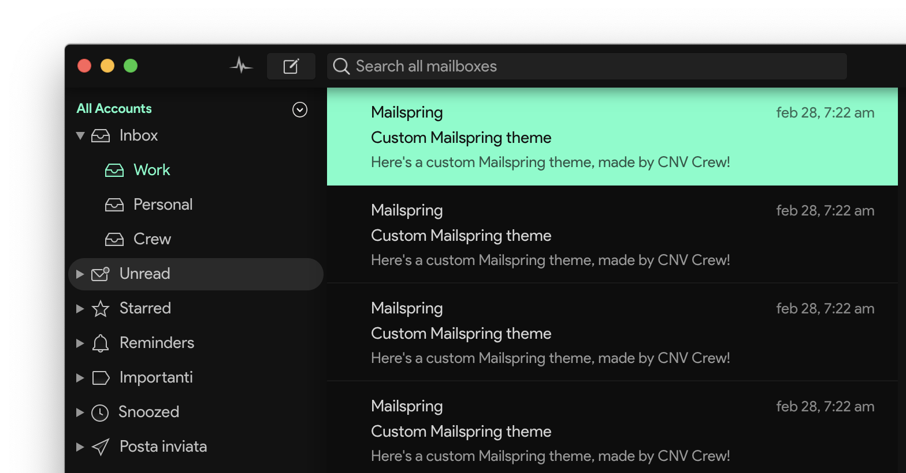

	

<h1 align="center">
	Mailspring CNV Theme
</h1>

	A custom theme for the <a href="http://www.getmailspring.com/">Mailspring</a> email client, based on <a href="https://github.com/CNVCrew">@CNVCrew</a> UI taste.

<h3>Installation</h3>
Open Mailspring and install the theme by going to `Mailspring > Install New Theme...` and selecting the directory.

	

